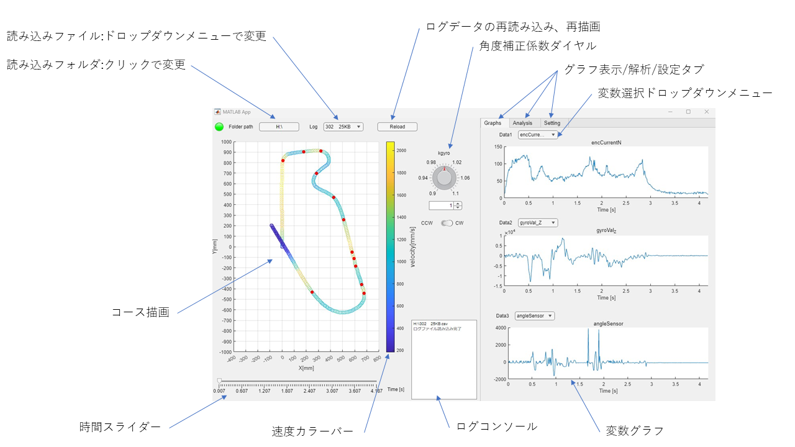
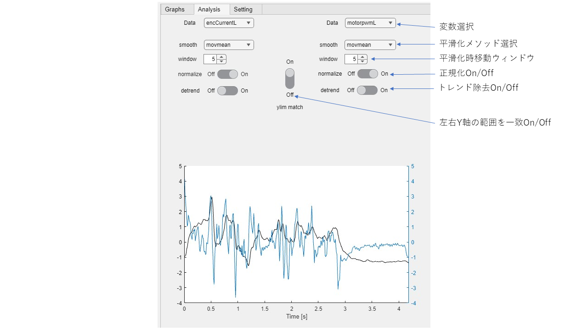
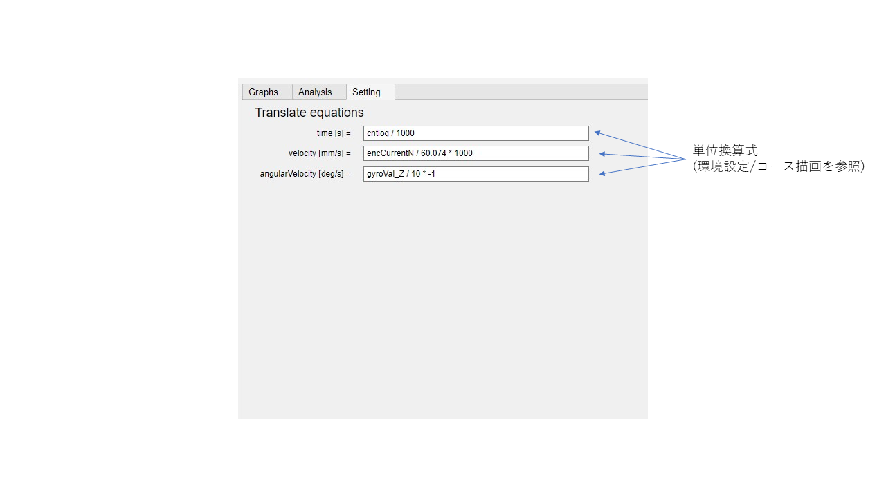

# robotracelogviewer
ロボトレースの走行中に記録したログデータをMATLAB Appで見やすく表示するアプリです。

# 動作確認環境
MATLAB R2022b

# 使い方
MATLABにアプリを以下から追加して起動する
[](https://jp.mathworks.com/matlabcentral/fileexchange/126839-csvloganalysis)

## メイン画面


## analysisタブ


## settingタブ


# 環境設定
## ログファイル
ログファイルはカンマ区切りのCSVファイルで構成されています。
1行目は変数名、2行目以降に値が記録されています。
変数の増減、変数名に制限はありません。ただしコース描画をするには時間、速度、角速度が必要になります。

CSVファイル例

ファイル名は半角数字＋拡張子で作成してください。

```
cntlog,patternTrace,checkMarker,encCurrentN,encTotalN,angleSensor,modeCurve,gyroVal_Z,angle_Z,rawCurrentR,rawCurrentL,
7,11,0,1,11,-97,0,232,1,-18,-243,
17,11,0,9,73,-119,0,12,-2,-21,10,
27,11,0,14,188,-98,0,448,1,10,-162,
37,11,0,17,341,-99,0,-262,0,51,31,
47,11,0,18,512,-107,0,-277,-2,2,-123,
57,11,0,22,715,-108,0,107,-2,2,1,
67,11,0,25,947,-98,0,220,0,-5,-7,
77,11,0,26,1199,-97,0,-31,0,13,-15,
87,11,0,28,1480,-107,0,-135,-1,-2,4,
97,11,0,30,1828,-91,0,33,-1,2,2,
```

## コース描画
コース描画には時間と速度、角速度の情報が必要になります。
MATLAB Appでは変数名で認識する事ができるのでコード内の時間、速度、角速度の変数名を修正してください。
App Designerを起動し、設計ビューからUIデザイン内の設定タブを開き、各式のテキストエリアを編集してください。

**注意事項**
1. 必ず変数名を最初に書く。
2. 演算子、数値の間は半角スペースを1つ入れる。
3. 使用できる演算子は乗算、除算のみです。

例
```
encCurrentN / 60.074 * 1000
```

## 初期フォルダ
アプリ起動時に読み込むフォルダを設定します。
SDカードをマウントしたときのフォルダパスがおすすめです。

App Designerを起動し、設計ビューでH:と書かれているボタンをクリックし、右側のコンポーネントブラウザ→ボタン→テキストを編集する。
